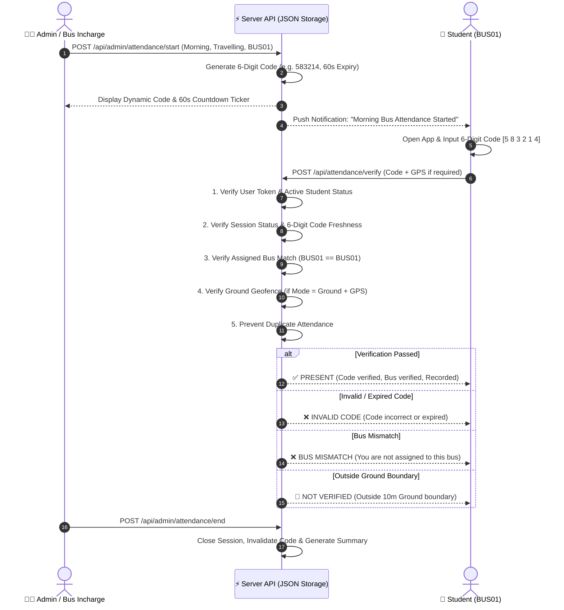

# 🚌 College Bus Attendance System

A production-quality, responsive **Morning & Evening Bus Attendance System** built as a modern Web Application & Progressive Web App (PWA).

The application uses **Dynamic 6-Digit Code Verification**, **Bus Assignment Isolation**, **Authoritative Server-Side Geofencing**, and **Zero Paid APIs or External Database Dependencies**.

---

## 📑 Table of Contents

- [🌟 System Highlights](#-system-highlights)
- [📐 Attendance Verification Flow](#-attendance-verification-flow)
- [🖥️ User Roles & Portals](#️-user-roles--portals)
- [🔑 Demo Accounts](#-demo-accounts)
- [⚡ Quick Start & Run Script](#-quick-start--run-script)
  - [1-Click Windows Launcher (`run.bat`)](#1-click-windows-launcher-runbat)
  - [Manual Terminal Commands](#manual-terminal-commands)
- [📊 Interactive Walkthrough Guide](#-interactive-walkthrough-guide)
  - [Step 1: Admin Dispatching Attendance Session](#step-1-admin-dispatching-attendance-session)
  - [Step 2: Student Entering 6-Digit Code & Verifying](#step-2-student-entering-6-digit-code--verifying)
  - [Step 3: Bus Incharge Live Roster](#step-3-bus-incharge-live-roster)
  - [Step 4: End Session & Consolidated Reports](#step-4-end-session--consolidated-reports)
- [⚙️ JSON Data Architecture](#️-json-data-architecture)
- [🧪 Automated Test Suite](#-automated-test-suite)
- [🚀 Deployment & Production](#-deployment--production)

---

## 🌟 System Highlights

- **Pure Software-Only Solution**: No RFID cards, hardware scanners, Arduino, Raspberry Pi, or dedicated GPS tracking devices.
- **Zero QR Codes**: Replaces static/printed QR codes with rotating dynamic 6-digit verification codes.
- **Dynamic 6-Digit Attendance Code**:
  - Cryptographically generated server-side.
  - Automatically rotates every **60 seconds** while the session is active.
  - Large visible display with **1-Click Copy Code** button for Admin/Incharge.
  - Automatically invalidated when the session ends.
- **Bus Assignment Isolation**:
  - Only students assigned to the active bus (`BUS01`) receive session notifications and can verify.
  - Students from other buses (`BUS02`) are rejected with `❌ BUS MISMATCH`.
- **Flexible Modes & Verification Options**:
  - **Sessions**: `Morning` (pickup/transit) and `Evening` (departure).
  - **Modes**: `Travelling Bus` (in-transit) and `College Ground` (fixed campus point).
  - **Verification**: `Dynamic Code + GPS` (default) or `Dynamic Code Only`.
- **Pure JSON File Storage**: Zero external database servers (no PostgreSQL, Supabase, MongoDB, or Firebase).
- **Authoritative Server Validation**: Server validates authentication, role, active student status, bus assignment, code freshness, duplicate prevention, and location distance.

---

## 📐 Attendance Verification Flow



---

## 🖥️ User Roles & Portals

| Role | Access Scope | Capabilities |
| :--- | :--- | :--- |
| **👑 Admin** | Global College Transit | • First-Time System Setup (`/setup`)<br>• Student Approvals (`/admin/approvals`) with bus assignment<br>• Fleet Management: Add & configure college buses<br>• Student Management: Add, edit, activate/deactivate students<br>• Live Session Dispatcher (Morning/Evening, Travelling/Ground, Code/GPS)<br>• Rotating 6-digit code display with 60s countdown timer<br>• Live Roster metrics (Total, Present, Not Verified)<br>• Daily consolidated reports & notification center |
| **🧑‍✈️ Bus Incharge** | Assigned Bus Only | • Dispatch Travelling Bus attendance for assigned route<br>• Live student checklist with real-time present counts<br>• Copy dynamic code for bus passengers |
| **📱 Student** | Personal Account | • Self-registration signup page (`/signup`)<br>• Status feedback (`PENDING APPROVAL`, `APPROVED`, `REJECTED`)<br>• Real-time notification card when assigned bus session starts<br>• 6-Digit Code entry interface<br>• Clear `✅ PRESENT` confirmation screen<br>• Personal historical attendance records log |

---

## 🔐 Real Data Lifecycle & Production Workflow

The application operates with **100% real stored data** with zero mock or fake data preloaded.

```text
DEPLOY APPLICATION
        ↓
1. FIRST-TIME ADMIN SETUP (/setup)
   Create master Administrator account
        ↓
2. ADMIN CONFIGURES BUSES (/admin/buses)
   Create real college bus routes (e.g. TN-01-AB-1234)
        ↓
3. STUDENT SIGNUP (/signup)
   Students register with Name, Reg No, Email, Phone, Password
        ↓
4. STUDENT STATUS = PENDING APPROVAL
   Student is blocked from logging in until approved
        ↓
5. ADMIN REVIEWS & ASSIGNS BUS (/admin/approvals)
   Admin selects authoritative bus and clicks [ APPROVE ]
        ↓
6. STUDENT STATUS = APPROVED + ACTIVE
   Student receives notification and can now login
        ↓
7. ATTENDANCE DISPATCH & CODE VERIFICATION
   Admin starts session -> Student inputs 6-digit code -> PRESENT
```

---

## ⚡ Quick Start & Run Script

### 1-Click Windows Launcher (`run.bat`)

Double-click `run.bat` in the project root to open the interactive control menu:

```
===============================================================================
               COLLEGE BUS ATTENDANCE SYSTEM - CONTROL PANEL
===============================================================================

  [1] Start Application (Express API + Vite Web Client + Auto Open Browser)
  [2] Run Automated Verification Tests (Code, Rotation, Geofence, Security)
  [3] Build Production Bundle (Vite + TypeScript)
  [4] Install / Repair Dependencies (npm install)
  [5] Exit

===============================================================================
Please enter your choice (1-5) [Default is 1]: 
```

- Automatically verifies Node.js & npm installations.
- Installs dependencies if `node_modules` is missing.
- Opens your default web browser at `http://localhost:5173` upon launch.

---

### Manual Terminal Commands

```bash
# 1. Install dependencies
npm install

# 2. Run both API server (port 3001) and Vite frontend (port 5173)
npm run dev

# 3. Run automated verification suite
npm test

# 4. Build production bundle
npm run build
```

---

## 📊 Interactive Walkthrough Guide

### Step 1: Admin Dispatching Attendance Session
1. Log in as **Admin** (`admin@example.com` / `admin123`).
2. On the Dashboard, find the **Attendance Session Controller**.
3. Select **Session**: `Morning` (or `Evening`).
4. Select **Attendance Mode**: `Travelling Bus` (or `College Ground`).
5. Select **Target Bus**: `BUS01`.
6. Select **Verification Requirement**: `Dynamic Code + GPS` (or `Dynamic Code Only`).
7. Click **`START ATTENDANCE`**.
   - A cryptographically random **6-digit code** (e.g., `583214`) is generated server-side.
   - The countdown timer begins counting down from `00:60`.
   - Click **`COPY CODE`** to copy the code.

### Step 2: Student Entering 6-Digit Code & Verifying
1. In another browser or incognito tab, log in as **Student 1** (`student1@example.com` / `student123` on `BUS01`).
2. Notice the active session panel:
   ```
   🚌 MORNING BUS ATTENDANCE
   Bus: BUS01 • Route: Route 1
   Attendance is ACTIVE
   Enter Attendance Code: [ 5 8 3 2 1 4 ]
   [ VERIFY ATTENDANCE ]
   ```
3. Enter the 6-digit code and click **`VERIFY ATTENDANCE`**.
4. Watch the verified checklist items complete:
   - `✓ Attendance session found`
   - `✓ Code verified`
   - `✓ Bus verified`
   - `✓ Location verified` (if Ground Mode)
5. The screen displays the confirmation badge:
   ```
   ✅ PRESENT
   Morning Attendance
   Student: Tarun Kumar
   Register No: 24EC001
   Bus: BUS01
   ```

### Step 3: Bus Incharge Live Roster
1. Log in as **Bus Incharge 1** (`incharge@example.com` / `incharge123`).
2. View the live checklist for `BUS01` updating in real-time as students submit attendance.

### Step 4: End Session & Consolidated Reports
1. In the Admin or Incharge portal, click **`END ATTENDANCE`**.
2. The dynamic code is invalidated, session is marked `CLOSED`, and attendance submissions are closed.
3. View the final consolidated attendance report under **Reports** (`/admin/reports`).

---

## ⚙️ JSON Data Architecture

All application records are persisted in the `data/` directory:

| File | Purpose |
| :--- | :--- |
| `data/students.json` | Student records, registration numbers, emails, assigned bus IDs, active status |
| `data/buses.json` | Bus routes, fleet numbers, incharge assignments |
| `data/attendance.json` | Verified attendance records, dynamic code used, timestamps, verification method |
| `data/active_session.json` | Current active session state, dynamic 6-digit code, code expiration timestamp |
| `data/settings.json` | Geofence presets, morning/evening schedules, accuracy limits, simulator |
| `data/notifications.json` | In-app alerts, session start notifications, and consolidated daily reports |
| `data/users.json` | Authentication credentials and role mappings |

---

## 🧪 Automated Test Suite

Run `npm test` to execute the **21 automated verification checks**:

```bash
> npm test

================================================================
🧪 BUS ATTENDANCE SYSTEM — 6-DIGIT CODE & GPS VERIFICATION SUITE
================================================================

--- 1. HAVERSINE DISTANCE VERIFICATION ---
  ✅ PASS: Exact coordinates yield 0.0m distance (got 0m)
  ✅ PASS: 5m distance calculation within tolerance (got 5m)
  ✅ PASS: 11m distance calculation within tolerance (got 11.12m)
  ✅ PASS: 50m distance calculation within tolerance (got 50.04m)

--- 2. TIME WINDOW & SESSION LOGIC ---
  ✅ PASS: At 16:49 IST session is UPCOMING
  ✅ PASS: At 16:50 IST session is ACTIVE
  ✅ PASS: At 16:52 IST session is ACTIVE
  ✅ PASS: At 16:55 IST session is CLOSED
  ✅ PASS: At 16:57 IST session is FINALIZED

--- 3. DYNAMIC 6-DIGIT CODE & BUS VERIFICATION ---
  ✅ PASS: Correct 6-digit code ("583214") marks BUS01 student as PRESENT
  ✅ PASS: Duplicate attendance returns existing record idempotently
  ✅ PASS: Wrong code ("999999") is rejected as INVALID_CODE
  ✅ PASS: BUS02 student rejected on BUS01 session with BUS_MISMATCH
  ✅ PASS: Expired code ("112233") is rejected as INVALID_CODE

--- 4. COLLEGE GROUND CODE + GPS VERIFICATION ---
  ✅ PASS: Valid code + GPS within 10m marks student as PRESENT
  ✅ PASS: Location outside 10m is handled accurately
  ✅ PASS: Code submission after session end is rejected

--- 5. REPORT GENERATION & ADMIN NOTIFICATIONS ---
  ✅ PASS: Report generated with 12 total students
  ✅ PASS: Report records at least 1 present student
  ✅ PASS: Report contains bus-wise breakdown for 2 buses
  ✅ PASS: Notifications recorded and available in notification center

================================================================
📊 TEST RESULTS: 21 PASSED, 0 FAILED
================================================================
```

---

## 🚀 Deployment & Production

The repository is configured for direct deployment to **Vercel**:
- `vercel.json` maps API endpoints to serverless functions.
- Automated cron jobs are configured for session open/close and report finalization at **4:57 PM IST**.
- Standard production bundle build:
  ```bash
  npm run build
  ```

---

© 2026 College Bus Transit Management System. All rights reserved.
